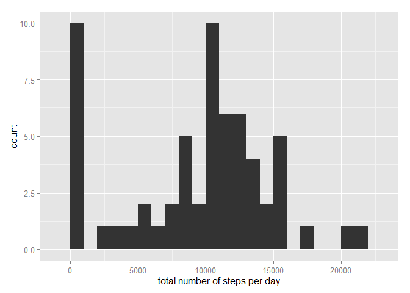
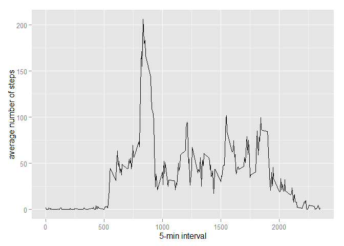
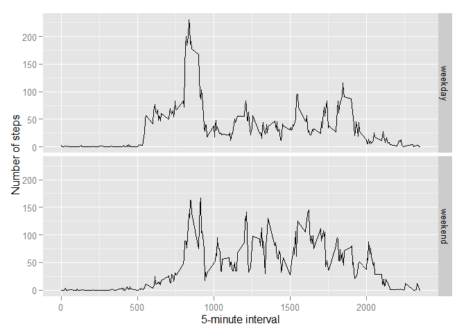

# Reproducible Research: Peer Assessment 1


## Loading and preprocessing the data

```r
#1 Load and preprocess the data
unzip(zipfile="activity.zip")
data <- read.csv("activity.csv")
```
## What is mean total number of steps taken per day?

```r
#2 Calculate the total number of steps. Make a histogram. Calculate and report the mean and median of the total number of steps.
library(ggplot2)
total.steps <- tapply(data$steps, data$date, FUN = sum, na.rm=TRUE)
qplot(total.steps, binwidth=1000, xlab="total number of steps per day")
```

 

```r
mean(total.steps, na.rm = TRUE)
```

```
## [1] 9354.23
```

```r
median(total.steps, na.rm = TRUE)
```

```
## [1] 10395
```
## What is the average daily activity pattern?

```r
#3 Make 5 minute interval plot 
library(ggplot2)
averages <- aggregate(x=list(steps=data$steps),
                     by=list(interval=data$interval),
                     FUN=mean, na.rm=TRUE)
ggplot(data=averages, aes(x=interval, y=steps))+ geom_line() + xlab("5-min interval") + ylab("average number of steps")
```

 


## Imputing missing values

```r
#4a make a table of missing values
missing <- is.na(data$steps)
#print out number of missing values
table(missing)
```

```
## missing
## FALSE  TRUE 
## 15264  2304
```

Use average for that 5 min interval to fill in missing values.

```r
#4b fill the missing values with average value for that 5 minute interval. Using a custom function FillValue
FillValue <- function (steps, interval) {
  filled <- NA
  if (!is.na(steps))
    filled <- c(steps) 
  else 
    filled <-(averages[averages$interval == interval, "steps"])
  return (filled)
}
filled.data <- data
filled.data$steps <- mapply(FillValue, filled.data$steps, filled.data$interval)
```

This data set can be used to make a histogram of the total number of steps taken each day and calculate the mean and median total.


```r
#5 Plot data with missing values populated
total.steps <-tapply(filled.data$steps, filled.data$date, FUN=sum)
qplot(total.steps, binwidth=1000, xlab="total number of steps taken each day")
```

 

```r
# reprint the mean and median after imputting missing values
mean(total.steps)
```

```
## [1] 10766.19
```

```r
median(total.steps)
```

```
## [1] 10766.19
```

## Are there differences in activity patterns between weekdays and weekends?

```r
#6 Create a function to identify weekday or weekend
WeekDayOrWeekend<- function(date){
    day <- weekdays(date)
    if(day %in% c("Monday", "Tuesday", "Wednesday", "Thursday", "Friday")) 
      return ("weekday") 
    else if (day %in% c("Saturday", "Sunday")) 
      return ("weekend") 
    else 
      stop("invalid date")
}
  filled.data$date <- as.Date(filled.data$date)
  filled.data$day <- sapply(filled.data$date, FUN = WeekDayOrWeekend)
```
Plot Weekend vs Weekday data.

```r
#7 Plot data 
averages <- aggregate(steps ~ interval + day, data=filled.data, mean)
ggplot(averages, aes(interval, steps)) + geom_line() + facet_grid(day ~ .) +
    xlab("5-minute interval") + ylab("Number of steps")
```

 
